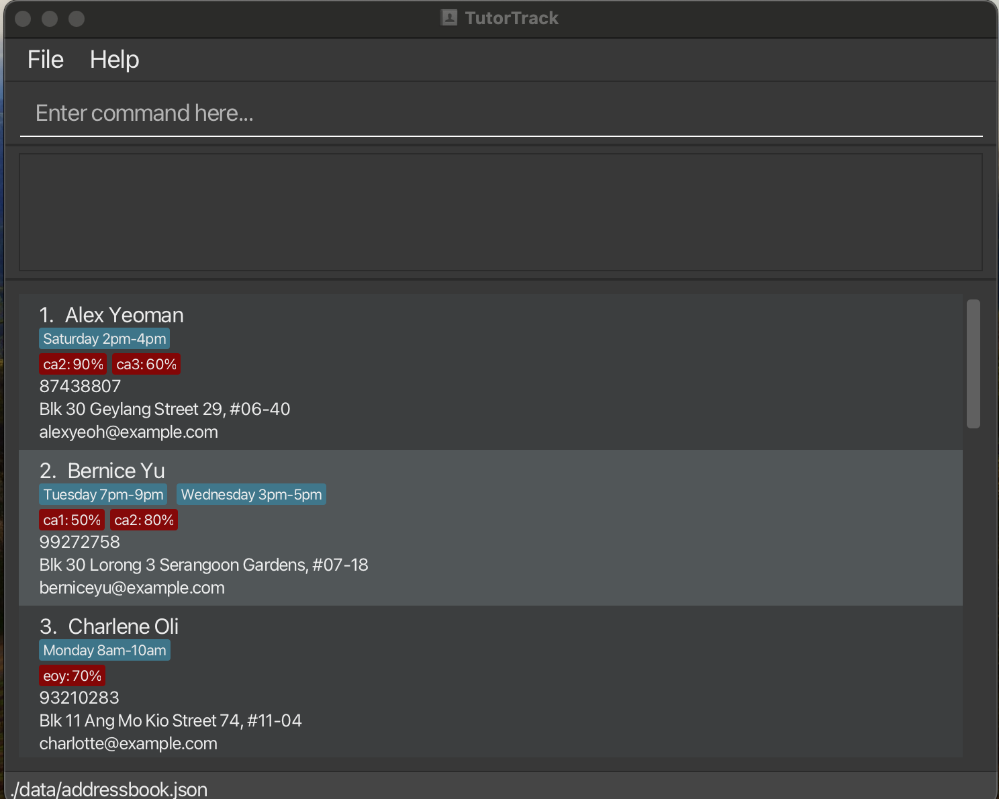
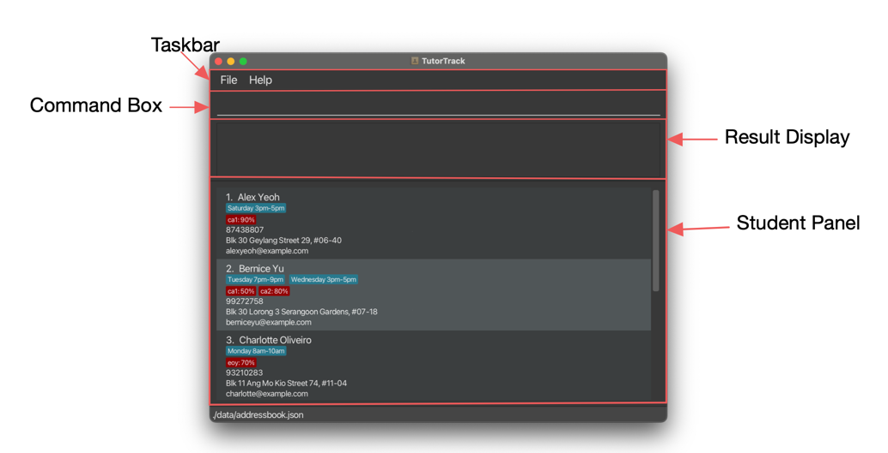
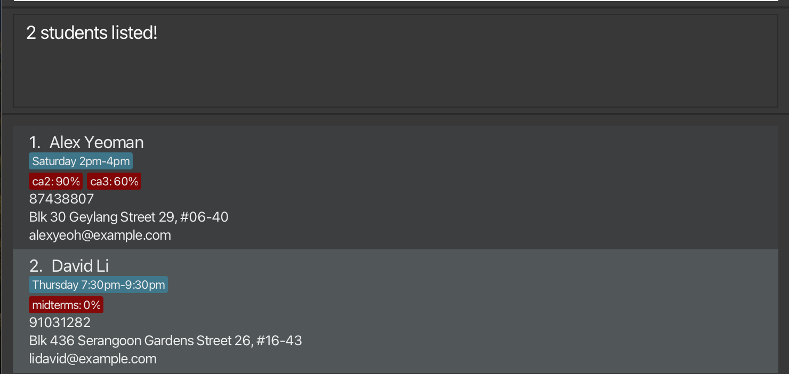
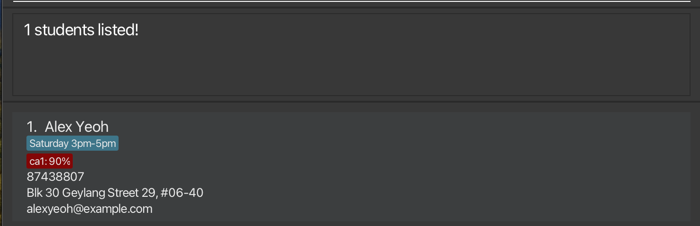

# TutorTrack User Guide

Welcome, Tutors! Thank you for choosing TutorTrack! Managing your students' contacts has never been easier with our desktop app
that is optimised for use via a Command Line Interface (CLI) while still having the benefits of a Graphical User Interface (GUI).

TutorTrack simplifies the consolidation and retrieval of student information, freeing you to concentrate on what you do
best: teaching. This User Guide provides comprehensive details to help you utilise TutorTrack to its full potential,
ensuring a smooth and efficient experience. Enjoy a hassle-free administration and focus more on your educational goals!

<!-- * Table of Contents -->
<page-nav-print />

--------------------------------------------------------------------------------------------------------------------

## Quick start

1. Ensure you have Java `11` or above installed in your Computer.

1. Download the latest `tutorTrack.jar` from [here](https://github.com/AY2324S2-CS2103-F08-4/tp/releases).

1. Copy the file to the folder you want to use as the _home folder_ for your AddressBook.

1. Open a command terminal, `cd` into the folder you put the jar file in, and use the `java -jar tutorTrack.jar` command to run the application. 
   A GUI similar to the below should appear in a few seconds. Note how the app contains some sample data. 
   

1. Type the command in the command box and press Enter to execute it. e.g. typing **`help`** and pressing Enter will open the help window. 
   Some example commands you can try:

   * `list` : Lists all contacts.

   * `add n/John Doe p/98765432 e/johnd@example.com a/John street, block 123, #01-01` : Adds a contact named `John Doe` to the Address Book.

   * `delete 3` : Deletes the 3rd contact shown in the current list.

   * `clear` : Deletes all contacts.

   * `exit` : Exits the app.

1. Refer to the [Features](#features) below for details of each command.

--------------------------------------------------------------------------------------------------------------------
## User Interface

- The `taskbar` presents you with the option to access help and exit the programme. 
- The `Commmand Box` would be where you can input your commands.
- The `Result Display` is where TutorTrack displays the command results, either with a success message or an error message
informing you of what requires fixing.
- The `Student Panel` is where you view your students' contact information. A more detailed look into each student card is shown below.

--------------------------------------------------------------------------------------------------------------------

## Features

<box type="info" seamless>

**Notes about the command format:** 

* Words in `UPPER_CASE` are the parameters to be supplied by the user. 
  e.g. in `add n/NAME`, `NAME` is a parameter which can be used as `add n/John Doe`.

* Items in square brackets are optional. 
  e.g. `n/NAME [t/TIMESLOTS]` can be used as `n/John Doe t/Saturday 4pm-6pm` or as `n/John Doe`.
  e.g. `n/NAME [g/GRADE]` can be used as `n/John Doe g/ca1: 100` or as `n/John Doe`.

* Items with `…`​ after them can be used multiple times including zero times. 
  e.g. `[t/TIMESLOTS]…​` can be used as ` ` (i.e. 0 times), `t/Saturday 4pm-6pm`, `t/Saturday 4pm-6pm t/Monday 4pm-6pm` etc.
   e.g. `[g/GRADE]…​` can be used as ` ` (i.e. 0 times), `g/ca1: 100`, `g/ca1: 100 g/ca1: 99` etc.

* Items in curly brackets refers to the current data. 
  e.g. `edit 1 grade: {GRADE}` display the current grade of index 1 user, `edit 1 grade: {eoy: 88}`.

* Parameters can be in any order. 
  e.g. if the command specifies `n/NAME p/PHONE_NUMBER`, `p/PHONE_NUMBER n/NAME` is also acceptable.

* Extraneous parameters for commands that do not take in parameters (such as `help`, `list`, `exit` and `clear`) will be ignored. 
  e.g. if the command specifies `help 123`, it will be interpreted as `help`.

* If you are using a PDF version of this document, be careful when copying and pasting commands that span multiple lines as space characters surrounding line-breaks may be omitted when copied over to the application.
</box>

### Viewing help : `help`

Shows a message explaining how to access the help page.

Format: `help`

### Adding a student: `add`

Adds a student to the address book.

Format: `add n/NAME p/PHONE_NUMBER e/EMAIL a/ADDRESS [t/TIMESLOTS]…​ [g/GRADES]…​`

<box type="tip" seamless>

**Tip:** A student can have any number of timeslots or grades (including 0)
</box>

<box type="info" seamless>

**Note:** Students with duplicate names are not allowed. Validity check for duplicated names are case-sensitive. 
e.g John Doe is not the same as John doe 
</box>

Examples:
* `add n/John Doe p/98765432 e/johnd@example.com a/John street, block 123, #01-01`
* `add n/Betsy Crowe e/betsycrowe@example.com a/Newgate Prison p/1234567 t/Saturday 5pm-7pm g/ca1: 2 g/ca2: 80`

For more information about each accepted parameter, refer to the [Accepted Parameters](#accepted-parameters) below.

### Listing all students : `list`

Shows a list of all students in the address book.

Format: `list`

### Editing a student : `edit`

Edits an existing student in the TutorTrack.

Format: `edit INDEX !n or !p or !e or !a or !t or !g`

* Edits the student at the specified `INDEX`. The index refers to the index number shown in the displayed student list. The index **must be a positive integer** 1, 2, 3, …​
* **Only one** variable field must be provided, i.e. either !n or !p and not both.
* Existing values will be updated to the input values.
* Allow modifications (add/edit/delete) in timeslots and grades, i.e. they will not be overwritten. 
  * Add: Separate using commas, i.e. `ca1: 2, ca2: 80` to `ca1: 2, ca2: 80, ca3: 66`
  * Edit: Make changes to the current data, i.e. `Saturday 5pm-7pm` to `Monday 5pm-7pm`
  * Delete: Remove the data, i.e. `ca1: 2, ca2: 80, ca3: 66` to `ca1: 2, ca3: 66`

<box type="info" seamless>

**Note:** Students with duplicate names are not allowed. Validity check for duplicated names are case-sensitive. e.g John Doe is not the same as John doe
</box>

Examples:
*  `edit 1 !p` will display `edit 1 phone: {PHONE_NUMBER}`, prompting user to make changes to the current phone number of the 1st student.
*  `edit 2 !g` will display `edit 2 grade: {GRADE}`, prompting user to modify (add/edit/delete) current grades of the 2nd student.

For more information about each accepted parameter, refer to the [Accepted Parameters](#accepted-parameters) below.

### Locating students by name: `find`

Finds students whose names contain any of the given keywords.

Format: `find KEYWORD [MORE_KEYWORDS]`

* The search is case-insensitive. e.g `hans` will match `Hans`
* The order of the keywords does not matter. e.g. `Hans Bo` will match `Bo Hans`
* Only the name is searched.
* The search functionality allow for partial matches e.g. `Han` will match `Hans`
* Students matching at least one keyword will be returned (i.e. `OR` search).
  e.g. `Hans Bo` will return `Hans Gruber`, `Bo Yang`

Examples:
* `find John` returns `john` and `John Doe`
* `find alex david` returns `Alex Yeoh`, `David Li` 
  

### Filtering students by timeslots: `filter`

Filters students whose timeslots contain any of the given keywords.

Format: `filter KEYWORD [MORE_KEYWORDS]`

* The search is case-insensitive. e.g `saturday` will match `Saturday`
* The order of the keywords does not matter. e.g. `Saturday Monday` will match `Monday Saturday`
* Only the timeslots are searched.
* The search functionality allow for partial matches e.g. `Sat` will match `Saturday`

Examples:
* `filter Sat` returns all students with `Saturday` in their timeslot
* `filter Saturday Sunday` returns all students with `Saturday` or `Sunday` in their timeslot 

### Sorting students by grades: `sort`

Sorts the list of students in the address book by the grades of a specified test.

Format: `sort TEST_NAME [/r]`

Sorts students based on their grades for the specified TEST_NAME.
If /r is specified, the students will be sorted in ascending order (lowest grade first). Otherwise, students will be sorted in ascending order (highest grade first).
The TEST_NAME is case-sensitive.
Examples:

sort Math sorts the students by their grades in Math in ascending order.
sort English /r sorts the students by their grades in English in descending order.

### Deleting a student : `delete`

Deletes the specified student from the address book.

Format: `delete INDEX`

* Deletes the student at the specified `INDEX`.
* The index refers to the index number shown in the displayed student list.
* The index **must be a positive integer** 1, 2, 3, …​

Examples:
* `list` followed by `delete 2` deletes the 2nd student in the address book.
* `find Betsy` followed by `delete 1` deletes the 1st student in the results of the `find` command.

### Clearing all entries : `clear`

Clears all entries from the address book.

Format: `clear`

### Exiting the program : `exit`

Exits the program.

Format: `exit`

### Saving the data

TutorTrack data are saved in the hard disk automatically after any command that changes the data. There is no need to save manually.

### Editing the data file

TutorTrack data are saved automatically as a JSON file `[JAR file location]/data/addressbook.json`. Advanced users are welcome to update data directly by editing that data file.

<box type="warning" seamless>

**Caution:**
If your changes to the data file makes its format invalid, TutorTrack will discard all data and start with an empty data file at the next run.  Hence, it is recommended to take a backup of the file before editing it. 
Furthermore, certain edits can cause TutorTrack to behave in unexpected ways (e.g., if a value entered is outside the acceptable range). Therefore, edit the data file only if you are confident that you can update it correctly.
</box>

--------------------------------------------------------------------------------------------------------------------

## FAQ

**Q**: How do I transfer my data to another Computer? 
**A**: Install the app in the other computer and overwrite the empty data file it creates with the file that contains the data of your previous AddressBook home folder.

--------------------------------------------------------------------------------------------------------------------

## Known issues

1. **When using multiple screens**, if you move the application to a secondary screen, and later switch to using only the primary screen, the GUI will open off-screen. The remedy is to delete the `preferences.json` file created by the application before running the application again.

--------------------------------------------------------------------------------------------------------------------
## Accepted Parameters
| Prefix       | Stands for                                                                                                 | Validity checks                                                                                                                                                                                                                                                                                                                                                                                                                                                                                                                         |
|--------------|------------------------------------------------------------------------------------------------------------|-----------------------------------------------------------------------------------------------------------------------------------------------------------------------------------------------------------------------------------------------------------------------------------------------------------------------------------------------------------------------------------------------------------------------------------------------------------------------------------------------------------------------------------------|
| **n/ or !n** | Name                                                                                                       | Must only contain alphanumeric characters and spaces, and it should not be blank. If name requires special characters, please find workarounds. e.g son of instead of s/o                                                                                                                                                                                                                                                                                                                                                               |
| **p/ or !p** | Phone Number                                                                                               | Must only contain numbers and should be at least 3 characters long.                                                                                                                                                                                                                                                                                                                                                                                                                                                                     |
| **e/ or !e** | Email                                                                                                      | Must be of the format: `local-part@domain`.   Local part should start with a alphanumeric character, only contain alphanumeric characters and `+`, `_`. `.`. `-`   This is followed by a '@' and then a domain name. The domain name is made up of domain labels separated by periods. The domain name must end with a domain label at least 2 characters long, have each domain label start and end with alphanumeric characters, have each domain label consist of alphanumeric characters separated only by hyphens, if any. |
| **a/ or !a** | Address                                                                                                    | Can take any value but must not be blank.                                                                                                                                                                                                                                                                                                                                                                                                                                                                                               |                                                                                                                                                                              
| **t/ or !t** | Timeslot                                                                                                   | Timeslot should be of the format: `DayOfWeek StartTime-EndTime`.   The DayOfWeek is any day from Monday to Sunday.   StartTime and EndTime include hours and optional minutes in 12-hour format. Minutes, if included, should be separated from hours by a colon. No checks are done to ensure that startTime is before endTime, so please take caution when entering timing details.                                                                                                                                           |                                                                                                                                                                                                                     
| **g/ or !g** | TestName and Grade. Grade represents the percentage gotten in the test rounded to the nearest whole number | Grades should be of the format `TestName: Grade`   The TestName should not be empty. This is followed by a `: ` and then a grade which must be a whole number in the range [0, 100]                                                                                                                                                                                                                                                                                                                                                 |
| **/r**       | Reverse the order of sort                                                                                  | Does not require any input after prefix                                                                                                                                                                                                                                                                                                                                                                                                                                                                                                 |                                                                                                                                                                                                                                                                                                                                                                                                                                                                                                |
--------------------------------------------------------------------------------------------------------------------

## Command summary

| Action     | Format, Examples                                                                                                                                                                               |
|------------|------------------------------------------------------------------------------------------------------------------------------------------------------------------------------------------------|
| **Add**    | `add n/NAME p/PHONE_NUMBER e/EMAIL a/ADDRESS [t/TIMESLOT]…​ [g/GRADE]…​`   e.g., `add n/John Doe p/98765432 e/johnd@example.com a/311, Clementi Ave 2, #02-25 t/Saturday 4pm-6pm g/ca1: 50` |
| **Clear**  | `clear`                                                                                                                                                                                        |
| **Delete** | `delete INDEX`  e.g., `delete 3`                                                                                                                                                            |
| **Edit**   | `edit INDEX !n or !p or !e or !a or !t or !g`   e.g.,`edit 2 !n`                                                                                                                            |
| **Find**   | `find KEYWORD [MORE_KEYWORDS]`  e.g., `find James Jake`                                                                                                                                     |
| **Filter** | `filter KEYWORD [MORE_KEYWORDS]`  e.g., `filter Saturday Sunday`                                                                                                                            |
| **Sort**   | `sort TEST_NAME [/r]`   e.g., `sort Math`, `sort English /r`                                                                                                                                |
| **List**   | `list`                                                                                                                                                                                         |
| **Help**   | `help`                                                                                                                                                                                         |
